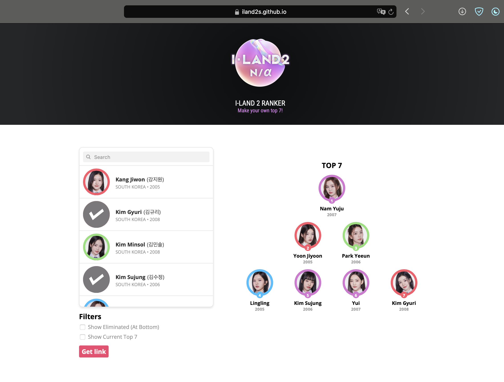

A personal ranker that allows you to rank and sort your own Top 7 (tba) for Mnet's idol survival show I-LAND 2, the sequel to I-LAND. It currently has functionality for adding and removing trainees on the table through click, sorting them on the ranking itself through drag & drop, and activating filters that show which contestants have been eliminated or currently hold a Top 7 (tba) position. It is also possible to save a link of your current ranking to revisit it as the episodes progress.

<b>Notes</b>
* For now (pre-show), the color borders around each contestant corresponds to which dance performance they were in, i.e. Heel Dance, Waacking, Girlish Choreo and Hiphop. This is subject to change.
* This was forked from the amazing [produce48 ranker](https://github.com/produce48/produce48.github.io).
* You can search contestants by alternative names, nationality, birth year and affiliations (eg. previous survival shows).

<b>Updates</b>
* 21/03: Ranker has been made, needs setting up
* 22/03: Ranker has been set up!
* 24/03: Thanos snapped
* 26/03: The unsnappening
* 29/03: Small QOL update
* 18/04: Updated trainee info

<b>WIP</b>
* Use the colors for Land/Ground instead when the ep airs
